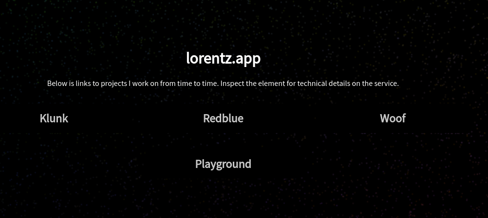
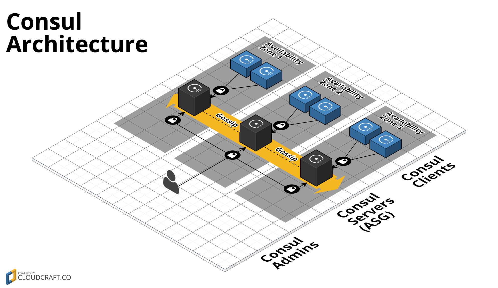

# Personal Hashistack cluster

This is the platform I was running for my microservices from ~2021-2023 where I hosted a multi-node cluster using hashistack, entrypoint being [https://lorentz.app](https://lorentz.app).
I stopped hosting it since the NAT gateways costed more than what it was worth.

I decided to publish the cluster here on github as a relic, my raspberry pi git-repo vanished when I was moving and I want to persist it somewhere.
Also figured that people might be interested in a reference if I talk about it.

Now (2024-11-01) [https://lorentz.app](https://lorentz.app) is just a static website using s3 bucket + cloudfront, deployed using [Pulumi (go SDK)](https://www.pulumi.com/), which costs me nothing per month.
I've also progressed into hobby-coding open source projects instead, mostly written in Go.
Checkout the projects from [my github profile](https://github.com/baalimago/).

## Design

This whole project is a playground.
A such, the design is quite ad-hoc.

The base of it is [this repository from hashicorp](https://github.com/hashicorp/terraform-aws-consul) which includes:

- Packer - For creating a custom AMI that has [Consul](https://www.consul.io/) and/or [Nomad](https://www.nomadproject.io/) installed.
- Multiple EC2 instances running ASG - The AMIs created by packer is deployed via ASG to EC2
- Priv/pub VPC - nothing special
- Firewalled ssh access to the instances

The result is a multi-node cluster which gossips via Nomad and Consul, with HA providing automatic recovery.

While I was job-hunting last year I setup [a Miro-presentation explaining the security of the deployments](https://miro.com/app/board/uXjVNSMSU2U=/?share_link_id=95742024722).
If you're interested in learning how it works, I could give another one, be in touch!

### Microservice cluster

Three core services:

1. [Nomad](https://www.nomadproject.io/) is the service orchestrator. It determines where to place a service depending on the resources available on the nodes.
1. [Consul](https://www.consul.io/) provides service discovery and configuration for the services.
1. [Traefik](https://traefik.io/traefik/), which is the ingress to the cluster.

There are two ways of deploying the services, either it's into Nomad or it's using ECS (only Fargate).
An example of a Fargate deployment is [here](./ecs-gallery.tf).
The thing to note is the `consul_service_tags`.
These tags are used by traefik to allow routing to the specific microservice.

The result of this is that each microservice got its own subdomain, routed via traefik.
Then there's a [Launcher service](./microservice-examples/launcher) which polls traefik for all registered services, and then displays them on the root page, `https://lorentz.app`.

So steps to deploy a new service is:

1. Publish docker image to ecr registry
1. Update version tag in `*.nomad` or `ecs-*.tf` file
1. Deploy to ECS or Nomad, using tags specifying it's metadata
1. Be discovered by Consul, setup communication to dependent microservices
1. Be added to the Launcher microservice, which in turn adds a button on the main webpage `https://lorentz.app`

All of these steps were scripted, so deploying a new service, or a new version, took minutes.
I didn't bother with CI/CD though, since I didn't see a need for it.

## Taking it for a spin

It should still work just fine, as long as you have AWS cli setup.
Although, hosting a dedicated service orchistrator in a multi-node autoscaling cluster is quite complex, especially considering all the tweaks I did to maintain it.
But, if you wish to give it a go though:

1. `terraform apply`
1. Create elastic IPs and attach to the nodes

The last step is done manually so that you can keep the elastic IPs targeted in DNS external DNS services on multiple reboots.
